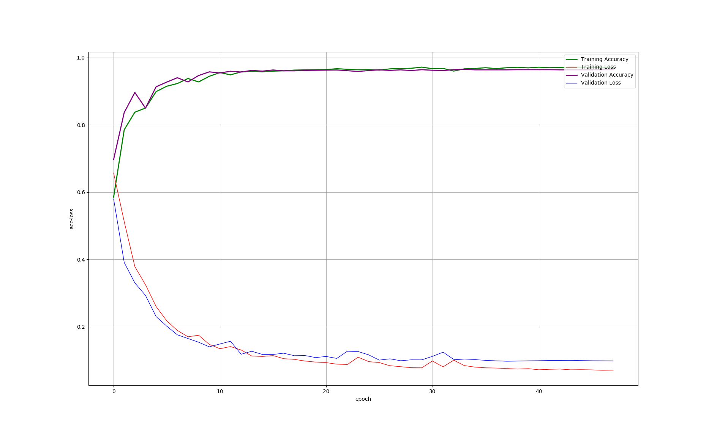
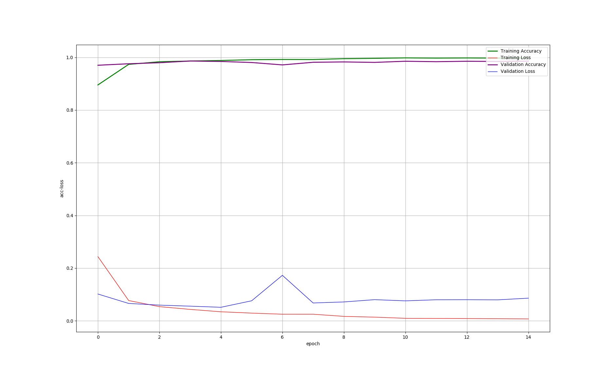
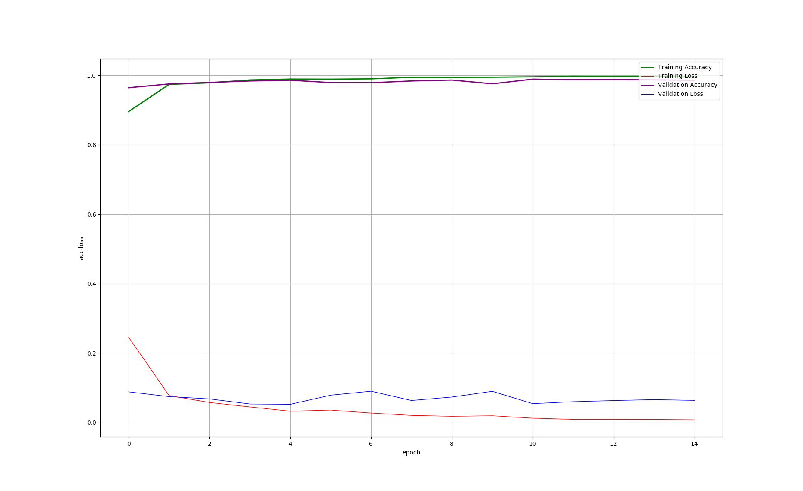

# SentimentClassification_UMICH_SI650
Kaggle竞赛题目"UMICH SI650 - Sentiment Classification" LSTM 实现  

## 1. 实现方法总结
以下各种实现方法的得分是针对相应代码中的参数和网络结构设计的情况下的得分, **此处不表示各种算法本身的性能和效果对比**

| 实现方法 | 验证集准确率 | 迭代次数(采用early stopping)近似值 | batch_size | 说明 |
| :------ | :---: | :---: | :---: | :------ |
| v1.0 | 96.35% | 38 | 512 | 1. 采用预训练的词向量模型生成的词向量([GoogleNews-vectors-negative300.bin](https://github.com/3Top/word2vec-api))矩阵表示句子 2. 去除了停用词 |
| v1.1 | 96.57% | 4 | 8 | 与v1.0区别: batch_size: 8 |
| v1.2 | 96.70% | 5 | 16 | 与v1.0区别: batch_size: 16 |
| v1.2.1 | 98.44% | 5 | 16 | 与v1.2区别: **没有**去除停用词 |
| v1.2.2 | 98.61% | 5 | 16 | 与v1.2区别: 1.**没有**去除停用词 2.最大句子长度由20改成40(与V2.*系列是40, 便于对比) |
| v1.3 | 96.22% | 7 | 32 | 与v1.0区别: batch_size: 32 |
| v1.4 | 96.44% | 12 | 64 | 与v1.0区别: batch_size: 64 |
| v1.5 | 96.48% | 14 | 128 | 与v1.0区别: batch_size: 128 |
| v1.6 | 96.18% | 15 | 256 | 与v1.0区别: batch_size: 256 |
| v1.7 | 96.35% | 22 | 1024 | 与v1.0区别: batch_size: 1024 |
| v2.0 | 98.4% | 21 | 1024 | 1. 采用自定义的词向量表示句子，不采用预训练的词向量模型生成的词向量矩阵表示句子 2. **没有**去除停用词 |
| v2.1 | 98.6% | 17 | 512 | 与v2.0区别: batch_size: 512 |
| v2.2 | 99.1% | 10 | 256 | 与v2.0区别: batch_size: 256 |
| v2.3 | 99.2% | 7 | 128 | 与v2.0区别: batch_size: 128 |
| v2.4 | 99.1% | 6 | 64 | 与v2.0区别: batch_size: 64 |
| v2.5 | 99.2% | 4 | 32 | 与v2.0区别: batch_size: 32 |
| v2.6 | 99.3% | 3 | 16 | 与v2.0区别: batch_size: 16 |
| v2.7 | 99.2% | 3 | 8 | 与v2.0区别: batch_size: 8 |
| v2.8 | 99.3% | 2 | 4 | 与v2.0区别: batch_size: 4 |
| v2.9 | 99.2% | 1 | 2 | 与v2.0区别: batch_size: 2 |
| v2.10 | 99.2% | 1 | 1 | 与v2.0区别: batch_size: 1 |

v1.0-v1.7是在[lxw0109/SentimentAnalysisOnMovieReviews](https://github.com/lxw0109/SentimentAnalysisOnMovieReviews)项目所实现的LSTM方法的基础上完成的  

**根据上表格中的结果(v1.0-v1.7比较, v2.0-v2.10比较), 我们能够印证之前学习过的一些理论:**  
+ 当batch_size过大时，准确率会降低  
 设置过大的batch_size，可能会对训练时网络的准确性产生负面影响，因为它降低了梯度下降的随机性  
+ 要在可接受的训练时间内，确定最小的batch_size  
 较小的batch_size能带来有更多起伏、更随机的权重更新  

## 2. 实现方法结果绘制
1. v1.0: 训练集和验证集上的loss和accuracy曲线如下图所示:  

2. v1.2.1: 与v1.2区别 **没有**去除停用词, 训练集和验证集上的loss和accuracy曲线如下图所示:  

3. v1.2.2: 与v1.2区别 **没有**去除停用词且最大句子长度由20改成40(与V2.*系列是40, 便于对比), 训练集和验证集上的loss和accuracy曲线如下图所示:  
  
通过对比v1.2, v1.2.1, v1.2.2的结果，我们可以得出:  
+ 数据预处理操作对于模型的准确率有比较大的影响: 例如这里体现出来的是否去除停用词(或停用词的粒度问题:只去标点 or 去除标点和停用词)
4. v2.0: 训练集和验证集上的loss和accuracy曲线如下图所示:
![docs/images/[wo_pretrained]ep4_bs32.png](docs/images/[wo_pretrained]ep4_bs32.png)
5. v2.5: 训练集和验证集上的loss和accuracy曲线如下图所示:
![docs/images/[wo_pretrained]ep21_bs1024.png](docs/images/[wo_pretrained]ep21_bs1024.png)

v2.*其他的曲线与v2.0和v2.5基本都类似，这里省略
